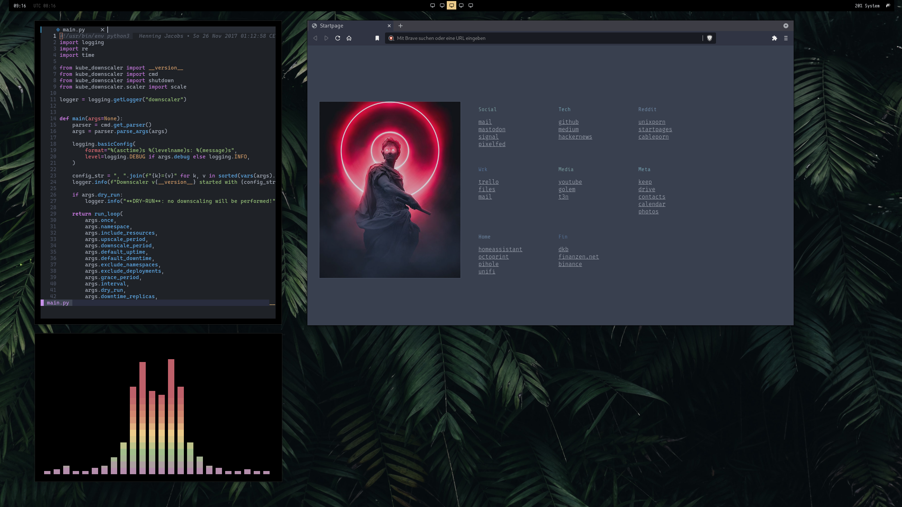

# dotfiles



using this:

   - **WM:** [bspwm](https://github.com/baskerville/bspwm)
   - **OS:** [Manjaro](https://manjaro.org/)
   - **Terminal:** [kitty](https://github.com/kovidgoyal/kitty)
   - **Shell:** [zsh](https://www.zsh.org/) and [oh-my-zsh](https://github.com/ohmyzsh/ohmyzsh)
   - **Panel:** [polybar](https://github.com/polybar/polybar/)
   - **Compositor:** [picom](https://github.com/yshui/picom)
   - **Editor:** [neovim](https://github.com/neovim/neovim/) and [lunarvim](https://github.com/LunarVim/LunarVim) 
   - **Browser:** [brave](https://brave.com/)
   - **File Manager:** [thunar](https://github.com/xfce-mirror/thunar)
   - **Application Launcher:** [rofi](https://github.com/davatorium/rofi)

restore with cyberninja kung-fu: 

```shell
cd ~
git init .
git remote add -t \* -f origin git@github.com:jnmcfly/dotfiles.github
git checkout -f cool-curie
```
